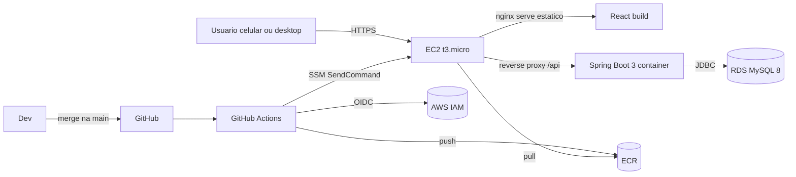
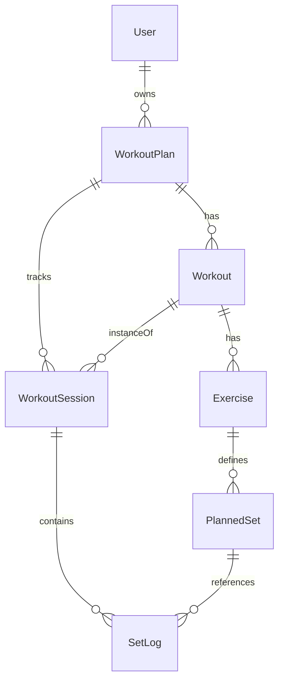

# Gym Tracker

[](https://github.com/caioefdds/gym-tracker-web/actions/workflows/deploy.yml)


Aplicação web responsiva (mobile e desktop) para acompanhar treinos de academia, registrar carga e repetições por série e visualizar progresso ao longo do tempo. Multi-usuário, com autenticação JWT.

> Versão web do app Flutter [iOS](../gym_tracker), agora acessível de qualquer dispositivo.

## Sumário

- [Arquitetura](#arquitetura)
- [Modelo de domínio](#modelo-de-domínio)
- [Stack](#stack)
- [Como rodar localmente](#como-rodar-localmente)
- [Estrutura do repositório](#estrutura-do-repositório)
- [API](#api)
- [CI/CD e deploy AWS](#cicd-e-deploy-aws)
- [Decisões técnicas](#decisões-técnicas)
- [Roadmap](#roadmap)

## Arquitetura



- **Stateless backend** com JWT — escala horizontal trivial se um dia precisar.
- **Frontend SPA** servido por nginx no mesmo container, com `proxy_pass /api` para o backend.
- **Deploy zero-downtime-ish** via `docker compose pull && up -d` (rolling restart de 1 container).

## Modelo de domínio



- **WorkoutPlan**: ficha de treino entregue pelo personal (ex.: ABCDE de 22/02/2026)
- **Workout**: cada treino A/B/C dentro da ficha
- **Exercise**: exercícios do treino
- **PlannedSet**: configuração de cada série (`WARMUP`, `WORKING`, `STRENGTH` + range de reps)
- **WorkoutSession**: execução de um treino em um dia específico
- **SetLog**: carga e reps efetivamente feitas em uma série

A query principal de UX (mostrar **"última vez"** ao registrar uma série) consulta o `SetLog` mais recente do mesmo `PlannedSet` em sessões anteriores — em uma única chamada `GET /api/sessions/{id}` com tudo embutido.

## Stack

### Backend
- Java 21, Spring Boot 3.5, Spring Web, Spring Security, Spring Data JPA, Spring Validation, Spring Boot Actuator
- MySQL 8 + Flyway (migrations)
- JJWT (HS256) + BCrypt
- springdoc-openapi (Swagger UI em `/swagger-ui.html`)
- Testes de integração com **Testcontainers** (MySQL real, sem mocks de DB)

### Frontend
- React 19, TypeScript, Vite
- TailwindCSS 4 (config via `@theme` e CSS vars)
- TanStack Query (cache de dados, invalidações declarativas)
- React Router v7
- React Hook Form + Zod (formulários tipados e validados)
- Recharts (gráficos de progresso)
- Zustand (auth store, persistência em localStorage)
- Axios com interceptor JWT
- date-fns (locale pt-BR)

### Infra
- Docker + docker-compose (dev e prod)
- AWS: EC2 + RDS + ECR + SSM + IAM
- GitHub Actions com **OIDC** (sem AWS access keys de longa duração)

## Como rodar localmente

Pré-requisitos: Docker, Java 21, Node 22+, Maven 3.9+.

```bash
# Sobe MySQL + backend + frontend (compila imagens na primeira vez)
docker compose up -d

# Ou: backend nativo + frontend nativo (mais rápido para iterar)
# 1) sobe só o MySQL:
docker compose up -d mysql

# 2) backend:
cd backend && mvn spring-boot:run

# 3) frontend:
cd frontend && npm install && npm run dev
```

URLs:
- App: http://localhost:5173
- API: http://localhost:8080
- Swagger: http://localhost:8080/swagger-ui.html
- Health: http://localhost:8080/actuator/health

## Estrutura do repositório

```
gym-tracker-web/
  backend/                   # Spring Boot
    src/main/java/com/caiofagundes/gymtracker/
      config/                # SecurityConfig, OpenApiConfig, AppProperties
      security/              # JwtService, JwtAuthFilter, AuthUser, CurrentUser
      user/                  # User entity, UserRepository, AuthService
      domain/                # Entidades JPA
      repository/            # Spring Data repositories
      service/               # PlanService, SessionService, ProgressService
      web/                   # REST controllers + DTOs
      common/                # exceções, GlobalExceptionHandler
    src/main/resources/db/migration/V1__init.sql
  frontend/                  # React + TS
    src/
      pages/                 # screens (Login, PlansList, PlanDetail, ActiveSession, ...)
      pages/tabs/            # WorkoutsTab, StartTab, ProgressTab
      components/ui/         # Button, Card, Input, Select, Label, Badge
      lib/api/               # client.ts (axios) + hooks.ts (TanStack Query)
      stores/auth.ts         # Zustand store
      types/api.ts           # tipos compartilhados com o backend
  deploy/
    aws-setup.md             # passo-a-passo AWS
    .env.example
  .github/workflows/deploy.yml
  docker-compose.yml         # dev
  docker-compose.prod.yml    # prod (imagens do ECR)
```

## API

Documentação interativa em **`/swagger-ui.html`** após subir o backend.

Resumo dos endpoints:

| Método | Path | Auth | Descrição |
|--------|------|------|-----------|
| POST | `/api/auth/register` | público | Cria usuário e retorna JWT |
| POST | `/api/auth/login` | público | Retorna JWT |
| GET | `/api/auth/me` | JWT | Usuário corrente |
| GET / POST | `/api/plans` | JWT | Lista / cria fichas |
| GET / PUT / DELETE | `/api/plans/{id}` | JWT | Detalhe (com workouts/exercises/sets) / edição / exclusão |
| POST | `/api/plans/{planId}/workouts` | JWT | Cria treino |
| PUT / DELETE | `/api/workouts/{id}` | JWT | Edita / exclui treino |
| POST | `/api/workouts/{workoutId}/exercises` | JWT | Cria exercício |
| PUT / DELETE | `/api/exercises/{id}` | JWT | Edita / exclui exercício |
| POST | `/api/exercises/{exerciseId}/planned-sets` | JWT | Cria série programada |
| PUT / DELETE | `/api/planned-sets/{id}` | JWT | Edita / exclui série |
| POST | `/api/workouts/{workoutId}/sessions` | JWT | Inicia sessão |
| GET | `/api/sessions/{id}` | JWT | Sessão + lastTime por série |
| POST | `/api/sessions/{id}/logs` | JWT | Registra série executada |
| PUT / DELETE | `/api/logs/{logId}` | JWT | Edita / exclui registro |
| POST | `/api/sessions/{id}/finish` | JWT | Finaliza sessão |
| GET | `/api/plans/{planId}/progress/exercises` | JWT | Lista exercícios com histórico |
| GET | `/api/plans/{planId}/progress?exerciseId=` | JWT | Série temporal de carga máxima e volume |

Toda query no backend é escopada pelo `userId` extraído do JWT — tentar acessar dado de outro usuário retorna 404.

## CI/CD e deploy AWS

Ver [`deploy/aws-setup.md`](deploy/aws-setup.md) para o passo-a-passo completo.

Pipeline (`.github/workflows/deploy.yml`):

1. **Em PR e push à main**: roda `mvn verify` (Testcontainers) no backend e `npm run build` no frontend.
2. **Apenas push à main**: assume IAM role via OIDC, faz `docker build + push` para ECR (`gym-tracker-backend` e `gym-tracker-frontend`) com tags `latest` e `${git_sha}`, e dispara `aws ssm send-command` na EC2 para `docker compose pull && up -d`.

Tempo médio: ~3 minutos do merge ao app no ar.

Secrets necessários no GitHub: `AWS_ACCOUNT_ID`, `AWS_REGION`, `EC2_INSTANCE_ID`. **Sem access keys da AWS** — autenticação OIDC.

## Decisões técnicas

- **Por que Drift no Flutter, JPA aqui?** O domínio é relacional, queries de agregação (progresso) são naturais em SQL. JPA + Flyway dá controle fino do schema e migrations versionadas.
- **Por que `intEnum` no Flutter mas `EnumType.STRING` aqui?** No backend, salvar `WORKING` em vez de `1` mantém o banco legível e evita que reordenar enums quebre histórico.
- **Por que `GET /api/sessions/{id}` retorna o `lastTime` embutido?** Evita N+1 requests do front. Uma única chamada já tem tudo para renderizar a tela de sessão.
- **Por que JWT 24h sem refresh token?** Uso pessoal; complexidade de refresh não compensa nesse cenário. Pode evoluir depois.
- **Por que SSM em vez de SSH para deploy?** Não precisa abrir porta 22 do EC2 para a internet, e auth é via IAM. Padrão AWS Well-Architected.
- **Por que OIDC em vez de access keys?** Credenciais temporárias (15min), revogáveis instantaneamente, escopadas ao repo + branch específicos.

## Roadmap

- [ ] Rest timer entre séries
- [ ] Biblioteca de exercícios reutilizáveis entre fichas
- [ ] Notas por série
- [ ] Refresh tokens (sessões longas)
- [ ] Export/import de dados (JSON/SQL)
- [ ] PWA (instalável, offline-friendly)
- [ ] Integração com health/fitness apps

## Licença

Projeto pessoal. Uso livre como portfólio/referência.
