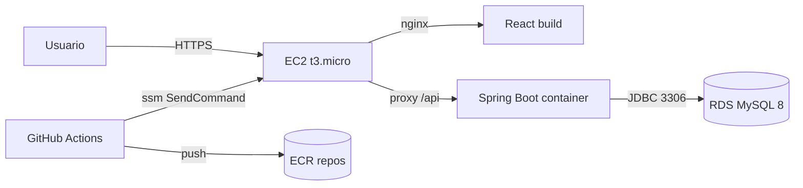

# AWS Setup — Gym Tracker

Guia passo-a-passo para deploy em AWS com infra mínima (EC2 + RDS + ECR + SSM).

## Visão geral



Componentes:

- 1x **EC2 t3.micro** Amazon Linux 2023 com Docker, executando `docker compose -f docker-compose.prod.yml`
- 1x **RDS db.t3.micro** MySQL 8 (privado)
- 2x **ECR repositories** (`gym-tracker-backend`, `gym-tracker-frontend`)
- **IAM Role** para a EC2 (lê do ECR + SSM agent)
- **IAM Role** para o GitHub Actions assumir via OIDC

Custo estimado dentro do free tier: **$0** nos primeiros 12 meses. Depois ~$15-25/mês.

## 1. ECR — repositórios das imagens

```bash
aws ecr create-repository --repository-name gym-tracker-backend --region us-east-1
aws ecr create-repository --repository-name gym-tracker-frontend --region us-east-1
```

## 2. OIDC Provider para GitHub Actions

Permite que o GH Actions assuma uma role da AWS sem precisar de access keys.

```bash
aws iam create-open-id-connect-provider \
    --url https://token.actions.githubusercontent.com \
    --client-id-list sts.amazonaws.com \
    --thumbprint-list 6938fd4d98bab03faadb97b34396831e3780aea1
```

Depois crie a IAM Role `GymTrackerDeployRole`:

```json
// trust-policy.json (ajuste o repo)
{
  "Version": "2012-10-17",
  "Statement": [{
    "Effect": "Allow",
    "Principal": {
      "Federated": "arn:aws:iam::AWS_ACCOUNT_ID:oidc-provider/token.actions.githubusercontent.com"
    },
    "Action": "sts:AssumeRoleWithWebIdentity",
    "Condition": {
      "StringEquals": {
        "token.actions.githubusercontent.com:aud": "sts.amazonaws.com"
      },
      "StringLike": {
        "token.actions.githubusercontent.com:sub": "repo:SEU_USUARIO/gym-tracker-web:*"
      }
    }
  }]
}
```

```bash
aws iam create-role --role-name GymTrackerDeployRole \
    --assume-role-policy-document file://trust-policy.json
```

Permissões mínimas (ECR push + SSM SendCommand):

```json
// deploy-policy.json
{
  "Version": "2012-10-17",
  "Statement": [
    {
      "Effect": "Allow",
      "Action": [
        "ecr:GetAuthorizationToken",
        "ecr:BatchCheckLayerAvailability",
        "ecr:GetDownloadUrlForLayer",
        "ecr:BatchGetImage",
        "ecr:InitiateLayerUpload",
        "ecr:UploadLayerPart",
        "ecr:CompleteLayerUpload",
        "ecr:PutImage"
      ],
      "Resource": "*"
    },
    {
      "Effect": "Allow",
      "Action": ["ssm:SendCommand", "ssm:GetCommandInvocation"],
      "Resource": "*"
    }
  ]
}
```

```bash
aws iam put-role-policy --role-name GymTrackerDeployRole \
    --policy-name GymTrackerDeployPolicy \
    --policy-document file://deploy-policy.json
```

## 3. IAM Role para o EC2

Permite que a instância puxe imagens do ECR e seja gerenciada via SSM.

```bash
aws iam create-role --role-name GymTrackerEC2Role \
    --assume-role-policy-document '{
      "Version":"2012-10-17",
      "Statement":[{"Effect":"Allow","Principal":{"Service":"ec2.amazonaws.com"},"Action":"sts:AssumeRole"}]
    }'

aws iam attach-role-policy --role-name GymTrackerEC2Role \
    --policy-arn arn:aws:iam::aws:policy/AmazonEC2ContainerRegistryReadOnly

aws iam attach-role-policy --role-name GymTrackerEC2Role \
    --policy-arn arn:aws:iam::aws:policy/AmazonSSMManagedInstanceCore

aws iam create-instance-profile --instance-profile-name GymTrackerEC2Profile
aws iam add-role-to-instance-profile \
    --instance-profile-name GymTrackerEC2Profile \
    --role-name GymTrackerEC2Role
```

## 4. RDS MySQL 8

```bash
# 1. Security group para o RDS (só permite acesso da EC2)
aws ec2 create-security-group --group-name gym-tracker-rds-sg \
    --description "Gym Tracker RDS"

# 2. Subnet group (use subnets default da sua VPC)
aws rds create-db-subnet-group \
    --db-subnet-group-name gym-tracker-subnets \
    --db-subnet-group-description "Gym Tracker subnets" \
    --subnet-ids subnet-xxxx subnet-yyyy

# 3. Cria a instância (t3.micro free tier)
aws rds create-db-instance \
    --db-instance-identifier gym-tracker-db \
    --db-instance-class db.t3.micro \
    --engine mysql --engine-version 8.0 \
    --master-username gymadmin --master-user-password CHANGE_ME \
    --allocated-storage 20 \
    --db-subnet-group-name gym-tracker-subnets \
    --vpc-security-group-ids sg-XXXX \
    --db-name gym_tracker \
    --backup-retention-period 7 \
    --no-publicly-accessible
```

Aguarde o `endpoint` aparecer com `aws rds describe-db-instances`.

## 5. EC2

```bash
# Security group: 80, 443 público; 22 só do seu IP
aws ec2 create-security-group --group-name gym-tracker-ec2-sg \
    --description "Gym Tracker EC2"

aws ec2 authorize-security-group-ingress --group-id sg-EC2 \
    --protocol tcp --port 80 --cidr 0.0.0.0/0
aws ec2 authorize-security-group-ingress --group-id sg-EC2 \
    --protocol tcp --port 443 --cidr 0.0.0.0/0

# (Opcional para SSH ad-hoc; idealmente use SSM Session Manager e nem abra 22)

# Liberar 3306 do EC2 SG no RDS SG
aws ec2 authorize-security-group-ingress --group-id sg-RDS \
    --protocol tcp --port 3306 --source-group sg-EC2

# Lança a instância (Amazon Linux 2023)
aws ec2 run-instances \
    --image-id ami-xxxxxxxx \
    --instance-type t3.micro \
    --iam-instance-profile Name=GymTrackerEC2Profile \
    --security-group-ids sg-EC2 \
    --tag-specifications 'ResourceType=instance,Tags=[{Key=Name,Value=gym-tracker}]' \
    --user-data file://user-data.sh
```

`user-data.sh`:

```bash
#!/bin/bash
set -e
dnf update -y
dnf install -y docker
systemctl enable --now docker
usermod -aG docker ec2-user

# Docker Compose v2 plugin
mkdir -p /usr/local/lib/docker/cli-plugins
curl -SL https://github.com/docker/compose/releases/latest/download/docker-compose-linux-aarch64 \
  -o /usr/local/lib/docker/cli-plugins/docker-compose
chmod +x /usr/local/lib/docker/cli-plugins/docker-compose

mkdir -p /opt/gym-tracker
cd /opt/gym-tracker
# docker-compose.prod.yml e .env serao copiados via SSM ou git clone
```

## 6. Primeiro deploy manual

Antes do CI/CD, valide subindo manualmente:

```bash
# Conecta via SSM (sem precisar SSH)
aws ssm start-session --target i-XXXXXXXXX

# Na EC2:
cd /opt/gym-tracker
# Copia docker-compose.prod.yml e .env (preencha valores reais)
sudo aws ecr get-login-password --region us-east-1 | sudo docker login \
    --username AWS --password-stdin AWS_ACCOUNT_ID.dkr.ecr.us-east-1.amazonaws.com
sudo docker compose -f docker-compose.prod.yml --env-file .env pull
sudo docker compose -f docker-compose.prod.yml --env-file .env up -d
sudo docker compose -f docker-compose.prod.yml ps
```

Acesse `http://EC2_PUBLIC_IP/` no navegador. Health check: `http://EC2_PUBLIC_IP/actuator/health`.

## 7. HTTPS (opcional mas recomendado)

Com domínio próprio + Route 53 + ACM (gratuito):

1. Aponte um A record do seu domínio → IP elástico da EC2.
2. Instale Certbot na EC2 (rodando em sidecar nginx) ou use Caddy como alternativa drop-in. Sugestão: substitua o `frontend` por um container Caddy que serve estáticos + faz proxy + emite cert automaticamente.

## 8. Logs e monitoramento

- Logs da aplicação: `docker compose logs -f backend` ou `docker logs -f`.
- Health: `/actuator/health`.
- (Opcional) CloudWatch Logs Agent na EC2 para logs centralizados.

## 9. Backup

RDS faz **automated backups** diários (configurado com `--backup-retention-period 7`). Para restore:

```bash
aws rds restore-db-instance-to-point-in-time \
    --source-db-instance-identifier gym-tracker-db \
    --target-db-instance-identifier gym-tracker-db-restored \
    --restore-time 2026-04-28T12:00:00Z
```

## Recap dos secrets necessários no GitHub

| Secret | Valor |
|--------|-------|
| `AWS_ACCOUNT_ID` | seu account id (12 dígitos) |
| `AWS_REGION` | ex: `us-east-1` |
| `EC2_INSTANCE_ID` | `i-XXXXXXXXXXXXX` |

**Nenhuma access key da AWS é necessária** — autenticação é via OIDC.
